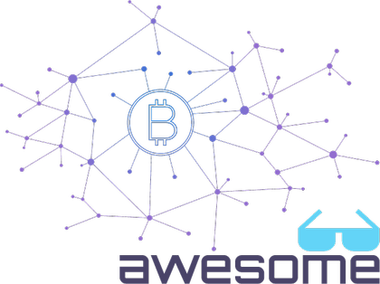

    

		
	

	 
	

		Curating the best <strong>Blockchain</strong> and Crytocurrency Resources
	

	

		Do you want to support this project?
		 
		
	

	 
     
	
     
    <small>Inspired by awesome and following the <a href="https://github.com/sindresorhus/awesome/blob/master/awesome.md">manifesto</a> guidelines.</small>  
     
	

		<small>This work aims to raise awareness of the possibilities offered by Blockchain technology; and create community around it.</small>
	

	 

---

Some links in this list are _affiliate links,_ but you can skip them if you want. If the &#x25BE; symbol appears in the description in blue (like this [&#x25BE;](#)), you can access the original link from it; If the symbol is black, the main link is clean.

Tips:  
If you find this list useful, you can also support it directly making a donation (no matter how small) to any of these wallet addresses:  
<small>  
 &nbsp; BTC: &nbsp; &nbsp; &nbsp; 1AEEDHrS6awC3R3jY79dEshrGTgqGEouyz  
 &nbsp; ETH: &nbsp; &nbsp; &nbsp; 0x2a4a95A050d1842AAADf04277F493E9946713466  
 &nbsp; LTC: &nbsp;&nbsp; &nbsp; &nbsp; Lhn6HJY1e67kbzpqQcftkin2Wo8ytx7z81  
 &nbsp; BCH: &nbsp;&nbsp; &nbsp; qz4y8s3rhvkvfea2dre8qxk02fmszmqxgcsakvdh60  
 &nbsp; NEO: &nbsp;&nbsp; &nbsp; AJD9NQfoYS2Xy197oyhFVcxTJFt5CqexnS  
 &nbsp; DASH:&nbsp;&nbsp;&nbsp; Xih5n81TRG9FNx8qUSuimUGyH4isGtUYWh
</small>

 
<small>[ Disclaimer: I am not a financial advisor and do not offer financial advice. Please do your own research before making any investment decisions. ]
</small>
 
 

## Contents

- [For Dummies](#for-dummies)
- [Where to Start?](#)
- [Blockchain Platforms](#)
- [Exchange and Trading](#)
	- [FIAT&#8596;Crypto Exchanges](#)
	- [P2P Marketplaces](#)
	- [Trading Platforms](#)
	- [Decentralized Exchanges (DEX)](#)
	- [DEX Platforms (Exchange + Dev. Platform)](#)
	- [Comparative overview between Advanced Trading Features](#)
	- [Invest with Popular Brokers](#)
	- [Crypto&#8596;Crypto conversion platforms](#)
	- [Gold Investments](#)
	- [ATMs Automated Teller Machines](#)
	- [Market Research](#)
- [Wallets](#)
- [Portfolio](#)
- [What´s cooking?](#)

 

