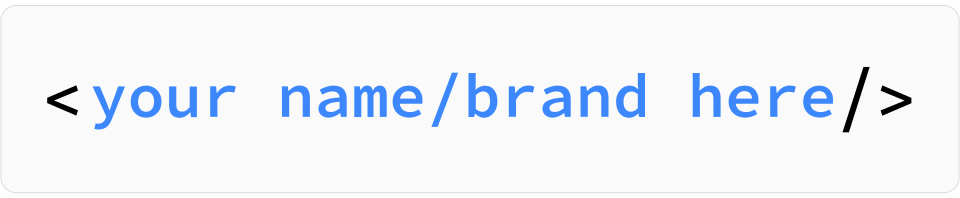

    

		
	

	 
	

		Curating the best <strong>Blockchain</strong> and Crytocurrency Resources
	

	

		Do you want to support this project?
		 
		
	

	 
     
	
     
    <small>Inspired by awesome and following the <a href="https://github.com/sindresorhus/awesome/blob/master/awesome.md">manifesto</a> guidelines.</small>  
     
	

		<small>This work aims to raise awareness of the possibilities offered by Blockchain technology; and create community around it.</small>
	

	 

---

Some links in this list are _affiliate links,_ but you can skip them if you want. If the &#x25BE; symbol appears in the description in blue (like this [&#x25BE;](#)), you can access the original link from it; If the symbol is black, the main link is clean.

Tips:  
If you find this list useful, you can also support it directly making a donation (no matter how small) to any of these wallet addresses:  
<small>  
 &nbsp; BTC: &nbsp; &nbsp; &nbsp; 1AEEDHrS6awC3R3jY79dEshrGTgqGEouyz  
 &nbsp; ETH: &nbsp; &nbsp; &nbsp; 0x2a4a95A050d1842AAADf04277F493E9946713466  
 &nbsp; LTC: &nbsp;&nbsp; &nbsp; &nbsp; Lhn6HJY1e67kbzpqQcftkin2Wo8ytx7z81  
 &nbsp; BCH: &nbsp;&nbsp; &nbsp; qz4y8s3rhvkvfea2dre8qxk02fmszmqxgcsakvdh60  
 &nbsp; NEO: &nbsp;&nbsp; &nbsp; AJD9NQfoYS2Xy197oyhFVcxTJFt5CqexnS  
 &nbsp; DASH:&nbsp;&nbsp;&nbsp; Xih5n81TRG9FNx8qUSuimUGyH4isGtUYWh  
</small>

 
<small>[ Disclaimer: I am not a financial advisor and do not offer financial advice. Please do your own research before making any investment decisions. ]
</small>
 
 

## Contents

- [For Dummies](#for-dummies)
- [Where to Start?](#)
- [Blockchain Platforms](#)
- [Exchange and Trading](#)
	- [FIAT&#8596;Crypto Exchanges](#)
	- [P2P Marketplaces](#)
	- [Trading Platforms](#)
	- [Decentralized Exchanges (DEX)](#)
	- [DEX Platforms (Exchange + Dev. Platform)](#)
	- [Comparative overview between Advanced Trading Features](#)
	- [Invest with Popular Brokers](#)
	- [Crypto&#8596;Crypto conversion platforms](#)
	- [Gold Investments](#)
	- [ATMs Automated Teller Machines](#)
	- [Market Research](#)
- [Wallets](#)
- [Portfolio](#)
- [What´s cooking?](#)

 

## For Dummies

- [Some things you need to know](https://bitcoin.org/en/you-need-to-know) - If you're getting started with Bitcoin, there are a few things you should know. 
- [Getting started with Bitcoin](https://bitcoin.org/en/getting-started) - How to use Bitcoin.
- [What is the Blockchain?](https://en.bitcoin.it/wiki/Block_chain) - Basic information about blockchain concept.
- [A Beginner's Guide to Blockchain Technology](https://www.coindesk.com/information/) - by coindesk.com
- [A Beginner’s Guide to Blockchain](https://hackernoon.com/a-beginners-guide-to-blockchain-d04266844e7) - by 
Febin John James
- [A beginner’s guide to getting started with cryptocurrencies](https://hackernoon.com/a-beginners-guide-to-getting-started-with-cryptocurrencies-76027bebb1b1) - Hacker Noon
- [WTF is The Blockchain?](https://hackernoon.com/wtf-is-the-blockchain-1da89ba19348) The ultimate 3500-word guide in plain English to understand Blockchain -  by Mohit Mamoria
- [Beginner’s guide series on cryptoassets:](https://medium.com/@linda.xie/beginners-guide-series-on-cryptoassets-d897535d887) Target audience is people who know about Bitcoin and are looking to learn more about other cryptoassets. - by Linda Xie

Learn about Bitcoin in a visual way:

- [Bitcoin Historical Price & Events](https://99bitcoins.com/price-chart-history/) - Accurate Bitcoin timeline.
- [The Biggest Moments in Bitcoin History <small>(2008-2014)</small> ](https://nativemerchantservices.com/content/uploads/2015/01/biggest-moments-in-bitcoin1.png) - Infographic <small>(Information mostly correct and relevant, with few errors pointed out [here.](https://www.reddit.com/r/Bitcoin/comments/2vnv1d/the_biggest_moments_in_bitcoin_history_infographic/) It is also included because it provides a quick overview for newbies)</small>
- [How a Bitcoin Transaction Works](https://spectrum.ieee.org/image/MjA3NDM1OA.jpeg) - <small>(Inaccurate/out of date but good to explaining simple concepts. Some inaccuracies indicated [here](https://www.reddit.com/r/Bitcoin/comments/1t4i5n/how_a_bitcoin_transaction_works_a_good/))</small>
- [67 Insane Facts About Bitcoin](https://bitcoinplay.net/58-insane-facts-about-bitcoin/) - 

Some video:

- [Have you ever wonder how bitcoin (and other cryptocurrencies) actually work?](https://www.youtube.com/watch?v=bBC-nXj3Ng4) - by 3blue1brown channel
- [Ethereum in 25 Minutes](https://www.youtube.com/watch?v=66SaEDzlmP4) - by Vitalik Buterin

Useful resources:

- [bitcoin.org](https://bitcoin.org/) - Bitcoin.org is dedicated to help Bitcoin to develop in a sustainable way.
- [bitcoinwiki](https://en.bitcoin.it/wiki/Help:FAQ) - Here you will find answers to the most commonly asked questions.
- [bitcointalk.org](https://bitcointalk.org) - Bitcoin forum  
- [r/bitcoin](https://www.reddit.com/r/Bitcoin/) -  Bitcoin subreddit.
- [r/ethereum](https://www.reddit.com/r/ethereum/) - Ethereum subreddit.
- [r/BlockChain](https://www.reddit.com/r/BlockChain/) - BlockChain subreddit.
- [r/CryptoCurrency](https://www.reddit.com/r/CryptoCurrency/) - CryptoCurrency subreddit.
- [Bitcoin Stack Exchange](https://bitcoin.stackexchange.com/) - Question and answer site for Bitcoin crypto-currency enthusiasts

Main whitepapers:

- [Bitcoin: A Peer-to-Peer Electronic Cash System](https://bitcoin.org/bitcoin.pdf) - by Satoshi Nakamoto
- [Ethereum whitepaper:](https://github.com/ethereum/wiki/wiki/White-Paper) A Next-Generation Smart Contract and Decentralized Application Platform - by Vitalik Buterin

[

](#contents)

## Where to Start?

### Where can I safely buy bitcoin?

&nbsp; [&nbsp; **Coinbase**](https://www.coinbase.com/join/5a5f62e4501844015bb4bfb5) [&#x25BE;](https://www.coinbase.com/) Buy digital currency (BTC, BCH, ETH and LTC) with Bank transfer and Credit/Debit Cards. &nbsp; 

&nbsp; [&nbsp; **Changelly**](https://changelly.com/?ref_id=f6ec7f14fb0d) [&#x25BE;](https://www.changelly.com/) Easy way to Buy Bitcoin with credit card.

&nbsp; [&nbsp; **PAXFUL**](https://paxful.com/es/roots/buy-bitcoin/index?affiliate=zGMky6AyQWb) [&#x25BE;](https://www.paxful.com/) Buy Bitcoins instantly. More than 300 ways to pay for bitcoins, including: Gift cards, Cash Deposits, Online Transfers, Debit/Credit Cards.

&nbsp; [&nbsp; **CEX**](https://cex.io/r/0/up120089788/0/) [&#x25BE;](https://www.cex.io/) Buy Bitcoin with VISA or Mastercard. Providing services in 99% countries around the globe.  
 

### Buy Bitcoins locally

&nbsp; [&nbsp;  **LocalBitcoins**](https://localbitcoins.com/?ch=rpkf) [&#x25BE;](https://www.localbitcoins.com/) Buy and sell bitcoins near you. Instant. Secure. Private. Multiple payment methods.

&nbsp; [&nbsp; **Remitano**](https://remitano.com/es?ref=xtokens) [&#x25BE;](https://www.remitano.com/) Remitano is a peer to peer Bitcoin exchange. Buy and Sell Bitcoin fast and securely.  
 

### Do you prefer to buy Bitcoins in traditional brokers?

&nbsp; [&nbsp; **eToro**](https://etoro.tw/2I6mD0M) [&#x25BE;](https://www.etoro.com/) We are the world's leading social trading network.

&nbsp; [&nbsp; **SimpleFX**](https://simplefx.com/n/_6012) [&#x25BE;](https://simplefx.com/) Ergonomic trading platform, providing traders across the globe with cutting edge technology, ultra light spreads and transparent conditions.  
 

### Exchange your digital assets

&nbsp;[&nbsp; **Binance**](https://www.binance.com/?ref=23138567) [&#x25BE;](https://www.binance.com/) Exchange the World. (Lowest fees!)

&nbsp;[&nbsp; **Kucoin**](https://www.kucoin.com/#/?r=HMu2Rv) [&#x25BE;](https://www.kucoin.com/) International blockchain assets exchange.

&nbsp;[&nbsp; **Huobi**](https://www.huobi.br.com/es-es/topic/invited/?invite_code=kch93) [&#x25BE;](https://www.huobi.pro/) The leading global digital asset exchange.  
 

### Where to conduct market research and check cryptocurrency signals?

&nbsp;[&nbsp; **CoinMarketCap**](https://coinmarketcap.com/) &#x25BE; Cryptocurrency market cap rankings, charts, and more!

&nbsp;[&nbsp; **TradingView**](https://tradingview.go2cloud.org/SH2Co) [&#x25BE;](https://www.tradingview.com/) Research and blogging platform for financial markets. Free charts & data.  
 

### Start shopping with cryptocurrencies

&nbsp;[&nbsp; **Purse**](https://app.purse.io/?_r=gPBUzH) [&#x25BE;](https://purse.io/) Save +15% on Your Amazon Order with Bitcoin and Bitcoin Cash!

&nbsp;[&nbsp; **OpenBazaar**](https://www.openbazaar.org/) &#x25BE; Open source, decentralized marketplace for peer-to-peer commerce using cryptocurrency.

&nbsp;[&nbsp; **CoinMap**](https://coinmap.org/) &#x25BE; Find a Bitcoin Merchant Near You.  
 

### Keep Your Cryptocurrencies Safely

The safest way to keep your digital assets is a **hardware wallet** like Ledger Nano, TREZOR, or Keepkey. There are also more economical and versatile options such as **software wallets** (apps) that you can install on your PC or smartphone such as Exodus, Jaxx or BRD.
If you want to HOLD your cryptocurrencies for a long time, you can choose a **cold wallet** like Billfodl, CRYPTO keystack or  made of metal in which you can keep your private keys stored in a safe place.

#### Hardware wallet:

&nbsp; [&nbsp; Ledger**Nano S**](https://www.ledgerwallet.com/r/7f88) [&#x25BE;](https://www.ledgerwallet.com/) Ledger is a global leader in securing crypto assets.

&nbsp; [&nbsp; **TREZOR**](https://shop.trezor.io?a=7j8vBZmmYL) [&#x25BE;](https://shop.trezor.io/) Securing your digital assets has never been more straightforward. "The Original Bitcoin Hardware Wallet".

&nbsp; [&nbsp; **KeepKey**](http://keepkey.go2cloud.org/SHCw) [&#x25BE;](https://www.keepkey.com/) The safe, simple and secure cryptocurrency hardware wallet.

#### Software wallet:

&nbsp; [&nbsp; **Exodus**](https://www.exodus.io/) &#x25BE; All-in-one app to secure, manage and exchange blockchain assets. ( Windows | Mac | Linux )

&nbsp; [&nbsp; **Jaxx**](https://jaxx.io/) &#x25BE; Your multi-asset #Blockchain Interface on 8 platforms. ( Mac & PC | iOS | Android )

&nbsp; [&nbsp; **BRD**](https://brd.com/) &#x25BE;  BRD is the simple and secure onramp to bitcoin, ethereum, and other digital currencies. ( iOS | Android )

#### Cold wallet:

&nbsp; [&nbsp; **Billfodl**](http://billfodl.com?afmc=28&utm_campaign=28&utm_source=leaddyno&utm_medium=affiliate) [&#x25BE;](https://billfodl.com/) The Safest Way to #HODL! We create offline products to keep your private keys safe.

&nbsp; [&nbsp; **CRYPTO**keystack](https://cryptokeystack.com/) &#x25BE; Stainless steel, DIY cryptocurrency wallet backup device for storing mnemonic phrases and private wallet keys.

&nbsp; [&nbsp; Cold**Ti**](https://amzn.to/2MSSfc0) [&#x25BE;](https://coldti.com/) The Simple way of cryptographic seed storage.  
 

### A bit of advice: Encrypted email

Communications with exchanges will be more secure if you use an encrypted email.

&nbsp;[&nbsp; **Protonmail**](hhttps://protonmail.com/) &#x25BE; Secure email that respects your privacy, brought to you by CERN scientists.  
 

### Keep learning

- [Blockchain Revolution:](https://amzn.to/2u20uvf) How the Technology Behind Bitcoin and Other Cryptocurrencies Is Changing the World.
- [Mastering Bitcoin for Starters:](https://amzn.to/2uc8Z6q) Bitcoin and Cryptocurrency Technologies, Mining, Investing and Trading.
- [Digital Gold:](https://amzn.to/2IZqzjx) Bitcoin and the Inside Story of the Misfits and Millionaires Trying to Reinvent Money.
- [The Inevitable:](https://amzn.to/2u1ukQB) Understanding the 12 Technological Forces That Will Shape Our Future.
- [Cryptoassets:](https://amzn.to/2u0GCc6) The Innovative Investor's Guide to Bitcoin and Beyond.
- [The Age of Cryptocurrency:](https://amzn.to/2NvtCDn) How Bitcoin and the Blockchain Are Challenging the Global Economic Order.
- [Blockchain Decrypted for 2018:](https://amzn.to/2KUn9A8) How To Profit With Crypto Currencies, Bitcoin, Coins And Altcoins This Year.
- [Cryptocurrency 2018:](https://amzn.to/2KS7rJ3) Mining, Investing and Trading in Blockchain, including Bitcoin, Ethereum, Litecoin, Ripple, Dash, others.
- [The Internet of Money:](https://amzn.to/2u8pdgQ) A Collection of Talks by Andreas M. Antonopoulos.
- [The Starfish and the Spider:](https://amzn.to/2tYuRTC) The Unstoppable Power of Leaderless Organizations.
- [Mastering Bitcoin:](https://amzn.to/2KWexcc) Programming the Open Blockchain. See on [github.](https://github.com/bitcoinbook/bitcoinbook)
- [The Book Of Satoshi:](https://amzn.to/2KUsojq) The Collected Writings of Bitcoin Creator Satoshi Nakamoto.
- [American Kingpin:](https://amzn.to/2zh8deh) Catching the Billion-Dollar Baron of the Dark Web.

[

](#contents)

